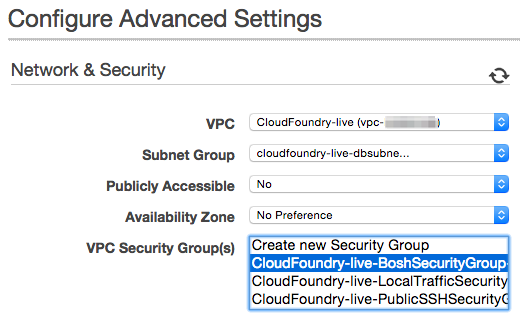
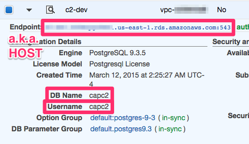

# Databases

While databases can be spun up within Cloud Foundry via [services](http://docs.cloudfoundry.org/devguide/services/), the preference is to use AWS-managed resources when possible. These make things like automatic backups easy to set up, and have a more sane default configuration than the default Postgres/MySQL install on Ubuntu.

## RDS

1. [Create the database instance](https://console.aws.amazon.com/rds/home?region=us-east-1#launch-dbinstance:ct=dashboard:) on AWS in the `us-east-1` region. On the "Configure Advanced Settings" step:
    1. Set the [VPC](http://aws.amazon.com/vpc/) to be `CloudFoundry-live`.
    1. Set the [VPC Security Group](http://docs.aws.amazon.com/AmazonVPC/latest/UserGuide/VPC_SecurityGroups.html) to be `CloudFoundry-live-BoshSecurityGroup-*`.
    1. The settings should now look like this:

        

1. Create a `client` tag so that it's billed properly.
1. Get the DB instance hostname once it's created.

    

1. Set the `DATABASE_URL` environment variable, using the `USERNAME`, `PASSWORD`, and `DBNAME` you set when creating the RDS instance, and the `HOST` from the previous step.

    ```bash
    cf set-env <APP_NAME> DATABASE_URL postgresql://<USERNAME>:<PASSWORD>@<HOST>:5432/<DBNAME>
    ```

The [dj_database_url](https://github.com/kennethreitz/dj-database-url#url-schema) Python package README describes the possible formats of this URL.

## Service

To start a database service instance within Cloud Foundry (where `DB_NAME` is something like `APP_NAME-ENV-db`):

```bash
cf create-service postgresql default <DB_NAME>
cf bind-service <APP_NAME> <DB_NAME>
cf restage <APP_NAME>
```

Note that for a Rails app, this will [overwrite your `database.yml`](http://docs.cloudfoundry.org/buildpacks/ruby/ruby-service-bindings.html#rails-applications-have-autoconfigured-database-yml).
